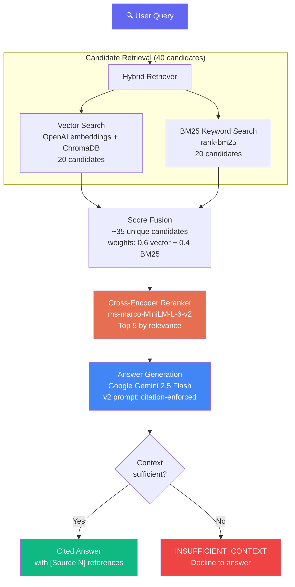
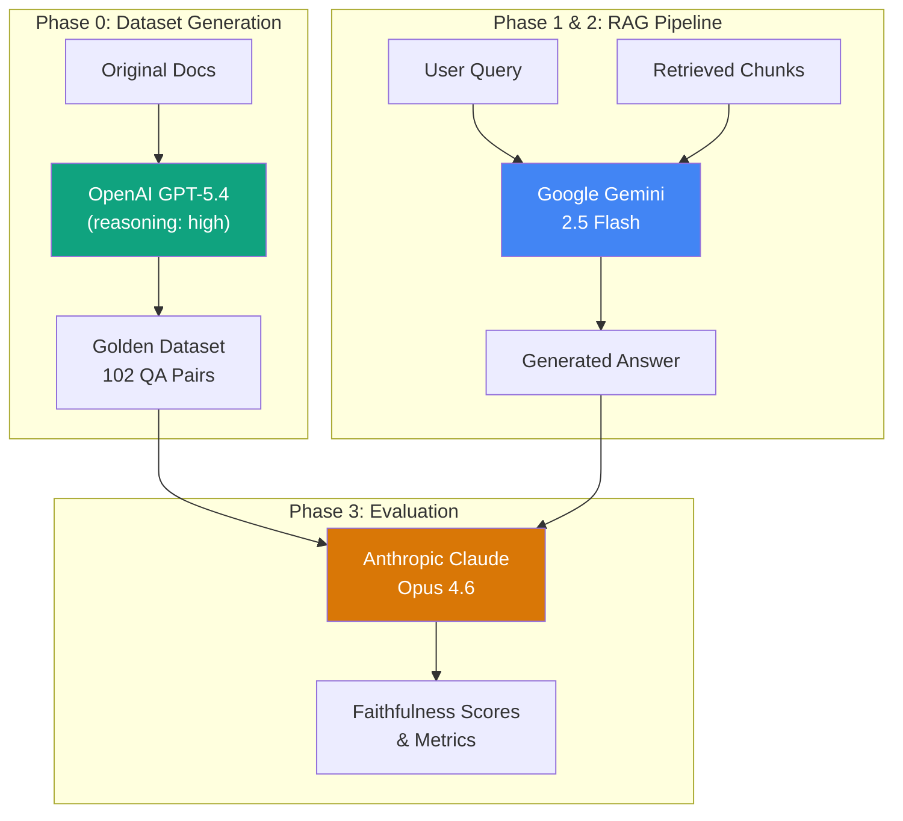

# LangChain & LangGraph RAG System

A production-grade Retrieval-Augmented Generation (RAG) pipeline built on LangChain and LangGraph documentation, featuring hybrid retrieval, cross-encoder reranking, citation enforcement, and automated evaluation with a three-vendor model separation strategy.

> **Detailed technical writeup:** [Read the full blog post here](https://sushrutgaikwad.github.io/projects/published/production-level-langchain-langgraph-rag/).
> **Golden dataset generator:** The Phase 0 dataset generation code lives in a [separate repository](https://github.com/SushrutGaikwad/golden-dataset-generator-for-lang-chain-graph-rag).


## Highlights

- **Hybrid retrieval** combining BM25 keyword search and vector similarity search with score fusion
- **Cross-encoder reranking** using `ms-marco-MiniLM-L-6-v2` for precision re-scoring of candidates
- **Citation enforcement** with inline `[Source N]` references and programmatic decline-to-answer when context is insufficient
- **Golden evaluation dataset** of 102 QA pairs across 6 question types, generated by GPT-5.4 with high reasoning effort
- **Ragas evaluation** scoring faithfulness, answer relevancy, context precision, and context recall using Claude Opus 4.6 as an independent evaluator
- **Three-vendor separation** ensuring no model evaluates its own output (OpenAI generates the dataset, Google generates RAG answers, Anthropic evaluates)
- **Gradio chatbot** with streaming responses and source citations
- **62 unit tests** running offline with mocked dependencies
- **CI pipeline** via GitHub Actions with a commented Ragas evaluation gate

## Evaluation Results

All 102 golden dataset questions were run through the pipeline and scored by Claude Opus 4.6 via Ragas:

| Metric | Score | Threshold | Status |
|:-------|------:|----------:|:------:|
| Faithfulness | 0.9561 | 0.70 | ✅ PASS |
| Answer Relevancy | 0.8572 | 0.70 | ✅ PASS |
| Context Precision | 0.8336 | 0.70 | ✅ PASS |
| Context Recall | 0.9220 | 0.70 | ✅ PASS |

## Architecture



## Three-Model, Three-Vendor Strategy

No model in the pipeline evaluates its own output. This eliminates self-evaluation bias:



| Role | Model | Vendor |
|:-----|:------|:------:|
| Golden dataset generation | GPT-5.4 (reasoning: high) | OpenAI |
| RAG answer generation | Gemini 2.5 Flash | Google |
| Evaluation & scoring | Claude Opus 4.6 | Anthropic |

## Project Structure

```text
lang-chain-graph-rag/
├── app.py                          # Gradio chatbot interface
├── prompts/
│   └── rag/
│       ├── v1.yaml                 # Phase 1: basic prompt
│       └── v2.yaml                 # Phase 2: citation-enforced
├── src/
│   ├── config.py                   # Central configuration
│   ├── ingestion/
│   │   ├── loader.py               # DocLoader: recursive markdown loading
│   │   └── chunker.py              # DocChunker: recursive text splitting
│   ├── retrieval/
│   │   ├── vector_store.py         # ChromaDB + OpenAI embeddings
│   │   ├── bm25_retriever.py       # BM25 keyword search
│   │   ├── hybrid_retriever.py     # Score fusion of vector + BM25
│   │   ├── reranker.py             # Cross-encoder reranking
│   │   └── retriever.py            # Basic retriever (Phase 1)
│   ├── generation/
│   │   ├── prompt_templates.py     # YAML prompt loader
│   │   └── generator.py            # Gemini 2.5 Flash wrapper
│   ├── evaluation/
│   │   └── evaluator.py            # Ragas evaluation with Claude Opus 4.6
│   └── pipeline/
│       ├── rag_chain.py            # Phase 1 pipeline
│       └── rag_chain_v2.py         # Phase 2 production pipeline
├── scripts/
│   ├── ingest.py                   # Document ingestion pipeline
│   ├── query.py                    # Interactive CLI query tool
│   ├── evaluate.py                 # Full Ragas evaluation
│   └── ci_eval.py                  # CI-compatible evaluation with exit codes
├── tests/                          # 62 unit tests (no API calls)
├── data/
│   ├── raw/docs/                   # LangChain & LangGraph documentation
│   ├── eval/
│   │   ├── golden_dataset.json     # 102 QA pairs from Phase 0
│   │   └── eval_report.json        # Ragas evaluation results
│   └── chroma_db/                  # Persisted vector store
└── .github/
    └── workflows/
        └── ci.yml                  # GitHub Actions: tests + eval gate
```

## Getting Started

### Prerequisites

- Python 3.12+
- [uv](https://docs.astral.sh/uv/) package manager
- API keys for:
  - **OpenAI** (embeddings)
  - **Google** (Gemini 2.5 Flash for answer generation)
  - **Anthropic** (Claude Opus 4.6 for evaluation only)

### 1. Clone and install

```bash
git clone https://github.com/SushrutGaikwad/lang-chain-graph-rag.git
cd lang-chain-graph-rag
uv sync --dev
```

### 2. Configure API keys

Create a `.env` file in the project root:

```.env
OPENAI_API_KEY=your-openai-key
GOOGLE_API_KEY=your-google-key
ANTHROPIC_API_KEY=your-anthropic-key
```

The Anthropic key is only needed for running the Ragas evaluation. The chatbot and RAG pipeline require only the OpenAI and Google keys.

### 3. Run document ingestion

This loads the documentation, chunks it, embeds it with OpenAI, and persists to ChromaDB:

```bash
uv run python -m scripts.ingest
```

Takes about 30 seconds. You should see `Ingestion complete. Collection has 1425 chunks.`

### 4. Launch the chatbot

```bash
uv run python app.py
```

Open `http://127.0.0.1:7860` in your browser.

### 5. Run tests

```bash
uv run pytest tests/ -v
```

All 62 tests run offline with no API calls.

### 6. Run evaluation (optional, costs money)

This runs all 102 golden dataset questions through the RAG pipeline and scores them with Claude Opus 4.6:

```bash
uv run python -m scripts.evaluate
```

Takes 30-60 minutes. Results are saved to `data/eval/eval_report.json`.

## Tech Stack

| Component | Technology |
|:----------|:-----------|
| Orchestration | LangChain |
| Vector Store | ChromaDB |
| Embeddings | OpenAI `text-embedding-3-small` (1536 dims) |
| Keyword Search | BM25 via `rank-bm25` |
| Reranking | `cross-encoder/ms-marco-MiniLM-L-6-v2` |
| Answer Generation | Google Gemini 2.5 Flash |
| Evaluation | Ragas 0.4.3 with Claude Opus 4.6 |
| Logging | loguru |
| Testing | pytest (62 tests) |
| CI | GitHub Actions |
| Chatbot | Gradio |
| Package Management | uv |

## Development Phases

| Phase | Focus | Key Outcome |
|:-----:|:------|:------------|
| 0 | Golden Dataset | 102 QA pairs across 6 types, generated by GPT-5.4 |
| 1 | RAG Fundamentals | Ingestion, chunking, ChromaDB, basic retrieval, Gemini generation |
| 2 | Production Quality | Hybrid retrieval, reranking, citation enforcement, v2 prompt |
| 3 | Evaluation & CI | Ragas scoring with Claude Opus 4.6, CI quality gate |

## License

This project is for portfolio and educational purposes.
